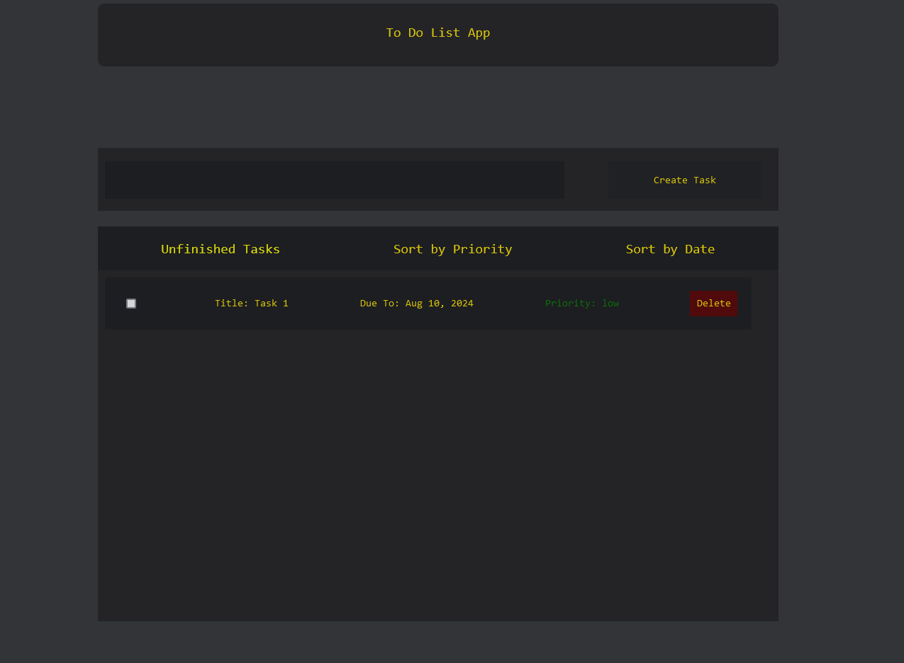

## To Do List

This project is a to do list containing the folllowing techonogies:
- Angular (Typescript / Javascript) #main-technolgy #framework
- Golang Programming Language #main-technology
- GORM #additional-library 
- .sqllite3 #database
- Wails.io #framework
- Docker (Build applications without wails and go and copy only executable file from container) #main-technology
---



## Common
---

To Do List App that provides:
- Task creation
- Task metadata specification (Priority, DueTo) (It's made to be processed by clicking on it)
- Task deletion
- Permanent and local saving in the database
- Two lists of Tasks: Finished and To-Do
- Filtration based on Priority and Date


Wails.io - is an Electron-like framework allowing the developers use the web-technologies into desktop development.

I've tried to implement the Client-Server logic where the 'Server' is a Golang business logic implementation (*ORM manipulation*)

**The *GORM* package was helpful to incapsulate the logic of working with sqllite3**

**Whether the Frontend is an Angular application.**

**In this framework the Frontend - Angular v18**
**The Backend - Golang / Wails.IO**


## Frontend-Architecture
---

In the frontend we've got an common services that allows us to 'globally' manipulate across the components of our client-application.

Also the *models* that provides the scale friendly incapsulated structures:
- Abstract Task -> Task | ...
- BaseSerializer -> Task Serializer | ...
- TaskCreator -> *Implements Factory Pattern to incapsulate direct instanciating*


There're two main *services*:
- Global Service
- API Service

#### Global Service
---
It's the service that can be associated with application itself:
- it manipulates with data
- it handles observable logic to globally communicate
- it tries to ease and keep components itself much leaner as it could possibly be
- works with models and uses their API
#### API Service
----
The service that handles the Golang communication and Serializes TypeScript Obj -> JSON | JSON -> TypeScript Obj:
- It transmits serialized Task
- Making Base CRUD operations (CREATE, READ, UPDATE, DELETE)


## Backend-Architecture
----

Backend also implements 'Adapter' Pattern to Deserialize and Serialize object from Frontend.

Creates and Operates the local database (.sqllite3)

And provides (at least i've tried) Generic scalable-friendly serialziers and CRUD processers to
add another objects and work with it in the same way

It uses GORM library to use ORM and instantly create the queries to database


## To install 
----
Clone the repository:
```c
git clone https://github.com/jali22ramazan22/YATDL.git
```

Install al dependendies 
```c
cd frontend && npm install --force && cd ../ && wails build 
```
If on Linux:
```c
cd build/bin && ./"To Do List"
```


Alternatively, you can use Docker to build and run the application in Linux (experimental) WITHOUT wails and golang:
```c
sudo apt-get update && sudo apt-get install -y --no-install-recommends \
                                   libwebkit2gtk-4.0-37 \
                                   libwebkit2gtk-4.0-dev \
                                   && apt-get clean \
                                   && rm -rf /var/lib/apt/lists/*
```


```c
docker build -t todolist -f dockerfile-linux .
docker run  -it --entrypoint /bin/bash todolist
```
In alternate terminal process
*You should find image labeled as todolist and alias tagged by docker itself: <container-name>*
```c
docker ps
docker cp <container-name>:/app/build/bin output-bin/
```


